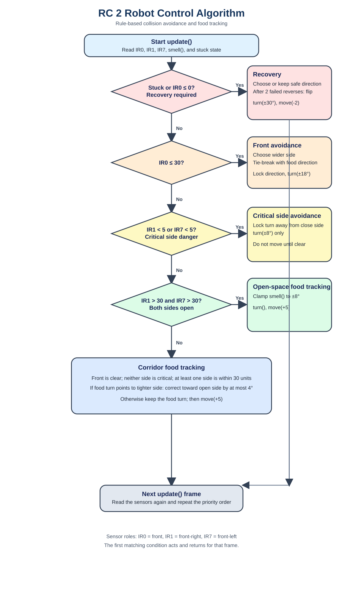

# PySimbot — Assignment RC 2

`RC_2.py` is an autonomous, rule-based controller for a PySimbot robot. Its objective is to reach the food while avoiding walls and obstacles. RC 2 improves the original controller by retaining a safe turn direction during obstacle avoidance, preventing side-collision movement, and continuing food tracking safely in corridors.

## Run the robot

Install the required packages:

```bash
python -m pip install -r requirements.txt
```

Start RC 2:

```bash
python RC_2.py
```

The setup is unchanged from RC 1: one autonomous robot, one food objective, keyboard control disabled, continuous simulation, and food relocation after collection.

## Algorithm flowchart



## Inputs

On every `update()` frame, the controller reads:

| Input | Meaning |
| --- | --- |
| `ir0 = self.distance(0)` | Distance directly in front of the robot |
| `ir1 = self.distance(1)` | Front-right distance |
| `ir7 = self.distance(7)` | Front-left distance |
| `angle_to_food = self.smell()` | Signed food angle from `-180°` to `+180°` |
| `self.stuck` | Set by PySimbot when a movement attempt cannot progress |

The controller uses the same three sensors and the same movement and turn values as RC 1.

## Constants

| Constant | Value | Purpose |
| --- | ---: | --- |
| `SAFETY_DISTANCE` | `30` | Front-obstacle warning distance |
| `CLOSED_DISTANCE` | `5` | Critical side-obstacle distance |
| `HIT_DISTANCE` | `0` | Front sensor is in contact with an obstacle |
| `FORWARD_STEP` | `5` | Forward movement command |
| `REVERSE_STEP` | `-2` | Recovery reverse command |
| `FOOD_TURN_DEGREE` | `8°` | Maximum food-following turn |
| `SIDE_TURN_DEGREE` | `8°` | Critical side-avoidance turn |
| `FRONT_TURN_DEGREE` | `18°` | Front-obstacle avoidance turn |
| `STUCK_TURN_DEGREE` | `30°` | Recovery turn after contact or being stuck |

## Decision priority

The first matching rule acts and returns. This gives collision recovery and obstacle avoidance priority over food tracking.

### 1. Recovery: stuck or front contact

Condition:

```python
self.stuck or ir0 <= 0
```

The robot chooses a safe direction using the two side distances, turns by `30°`, and reverses by `2` units. If the reverse movement fails twice in a row, it flips the avoidance direction to escape a corner or dead end.

### 2. Front obstacle avoidance

Condition:

```python
ir0 <= 30
```

The robot selects the side with more clearance, using the food direction only when both sides are equal. It locks that choice while the front remains blocked and turns by `18°` each frame. It does not move forward until the front is clear.

### 3. Critical side avoidance

Condition:

```python
ir1 < 5 or ir7 < 5
```

The robot locks a turn away from the close side and turns by `8°`. It deliberately does not move forward in this state: a front-sensor reading taken before the turn cannot guarantee that the new heading is clear of the same corner.

### 4. Open-space food tracking

Condition:

```python
ir1 > 30 and ir7 > 30
```

Both sides have room. The robot clamps the food angle to `-8°` through `+8°`, turns toward the food, and moves forward by `5` units.

### 5. Corridor food tracking

This is the remaining safe-travel state: the front is clear, neither side is critically close, but at least one side is within the `30`-unit safety distance.

The robot still turns toward the food and moves forward by `5` units. Before it turns, it checks whether the food direction would turn it toward the tighter side. If so, it makes a smaller correction toward the open side instead, capped at `4°`. This keeps the robot progressing toward food without steering into a nearby wall.

## Controller state

RC 2 uses small amounts of memory to reduce oscillation:

- `front_avoid_active` keeps the selected front-obstacle direction until the front becomes clear.
- `side_avoid_active` keeps the side-avoidance direction until the close side becomes safe again.
- `stuck_frames` counts consecutive failed recovery movements and flips direction after two failures.

## Why RC 2 is safer and more direct

| RC 1 behavior | RC 2 behavior |
| --- | --- |
| A prior side-avoidance state could affect a later front obstacle. | Front and side avoidance have separate state flags. |
| A close side only caused a turn, but its direction could change every frame. | The turn direction is locked until the side is clear. |
| Food tracking stopped in corridors with side distances from `5` to `30`. | Food tracking continues, but it will not turn toward the tighter side. |
| Recovery could repeat in the same blocked direction. | The direction flips after two failed reverse movements. |

## Files

- [`RC_2.py`](RC_2.py) — final RC 2 robot controller.
- [`Assignment_RC_1.py`](Assignment_RC_1.py) — original RC 1 controller.
- [`rc_2_algorithm_flowchart.svg`](rc_2_algorithm_flowchart.svg) — RC 2 decision flowchart.
- [`sensor_diagram.png`](sensor_diagram.png) — sensor layout.
- [`requirements.txt`](requirements.txt) — Python dependencies.

## License

This project is distributed under the GNU GPL license. See [`LICENSE`](LICENSE).
