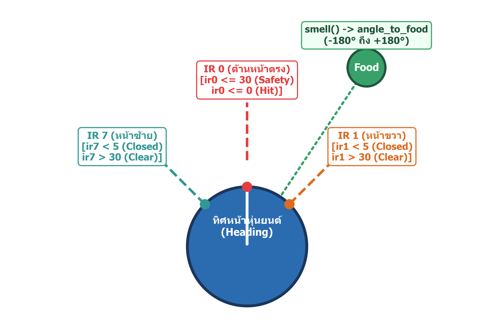
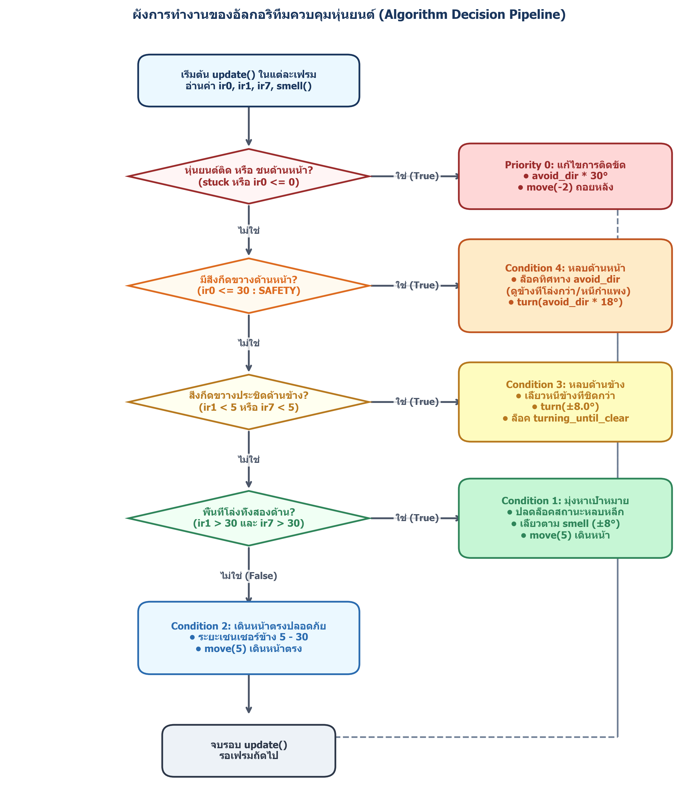

# PySimbot — Assignment RC 1

This repository contains a rule-based collision-avoidance robot for the PySimbot simulator. The main implementation is [`Assignment_RC_1.py`](Assignment_RC_1.py).

The robot has one objective (food). It uses infrared distance sensors to avoid walls and obstacles, and uses the food direction to guide its movement when the path is open.

## Running the simulation

Install the required packages:

```bash
python -m pip install -r requirements.txt
```

Run the assignment:

```bash
python Assignment_RC_1.py
```

The application starts one autonomous robot and one food objective. Keyboard control is disabled, and the simulation continues running after the objective is collected.

## Robot inputs

The `update()` method reads four values on every simulation frame:

```python
ir0 = self.distance(0)  # front sensor
ir1 = self.distance(1)  # front-right sensor
ir7 = self.distance(7)  # front-left sensor
angle_to_food = self.smell()  # signed angle from -180 to +180 degrees
```

PySimbot provides eight distance sensors at 45-degree intervals. This algorithm uses the three sensors most relevant to forward movement:

- `IR 0`: directly in front of the robot.
- `IR 1`: front-right side.
- `IR 7`: front-left side.

`distance()` returns the distance to the nearest wall or obstacle along the sensor ray. The simulator's maximum sensor distance is 100 units. `smell()` returns the signed angle from the robot's heading to the food; the algorithm limits food-following turns to a small range so the robot does not make sharp turns while travelling through open space.



## Control constants

| Constant | Value | Meaning |
| --- | ---: | --- |
| `SAFETY_DISTANCE` | `30` | Front obstacle warning distance |
| `CLOSED_DISTANCE` | `5` | Side is considered too close |
| `HIT_DISTANCE` | `0` | Front sensor is touching an obstacle |
| `FORWARD_STEP` | `5` | Forward movement per frame |
| `REVERSE_STEP` | `-2` | Reverse movement after getting stuck or hitting an obstacle |
| `FOOD_TURN_DEGREE` | `8°` | Maximum food-following turn |
| `SIDE_TURN_DEGREE` | `8°` | Turn used for a close side obstacle |
| `FRONT_TURN_DEGREE` | `18°` | Turn used for a front obstacle |
| `STUCK_TURN_DEGREE` | `30°` | Turn used when the robot is stuck or has reached an obstacle |

## Decision algorithm

`CollisionAvoidanceRobot.update()` evaluates conditions in priority order. The first matching condition performs an action and returns, so a dangerous situation always takes priority over food tracking.



### Priority 0: recover from being stuck or hitting an obstacle

```python
if self.stuck or ir0 <= HIT_DISTANCE:
    self.turning_until_clear = True
    self.turn(self.avoid_dir * STUCK_TURN_DEGREE)
    self.move(REVERSE_STEP)
    return
```

The robot turns by 30 degrees in its current avoidance direction and moves backward by two units. The `stuck` flag is set by PySimbot when a movement attempt cannot make progress.

### Condition 4: avoid an obstacle in front

If the front sensor detects an obstacle within 30 units, the robot turns without moving forward:

```python
if ir0 <= SAFETY_DISTANCE:
    self.turn(self.avoid_dir * FRONT_TURN_DEGREE)
    return
```

Before the turn, the robot selects `avoid_dir` using this preference:

1. If the front-left side (`ir7`) is closed, use the opposite direction.
2. Otherwise, if the front-right side (`ir1`) is closed, use the opposite direction.
3. Otherwise, choose the side with more available space.
4. If both sides are equally clear, use the sign of `angle_to_food` as a tie-breaker.

The `turning_until_clear` flag keeps the selected avoidance direction stable while the robot is continuously dealing with a front obstacle. This reduces rapid left-right oscillation.

### Condition 3: avoid a close side obstacle

If either side is closer than five units, the robot turns eight degrees toward the more open side and does not move during that frame:

```python
if ir1 < CLOSED_DISTANCE or ir7 < CLOSED_DISTANCE:
    if ir1 < ir7:
        self.avoid_dir = -1
        self.turn(-SIDE_TURN_DEGREE)
    else:
        self.avoid_dir = 1
        self.turn(SIDE_TURN_DEGREE)
    return
```

The positive and negative turn signs follow PySimbot's heading convention. The comparison between `ir1` and `ir7` determines which side has more clearance.

### Condition 1: follow the food in open space

When both side sensors report more than 30 units of clearance, the robot follows the food:

```python
if ir1 > SAFETY_DISTANCE and ir7 > SAFETY_DISTANCE:
    self.turning_until_clear = False
    turn_deg = max(-8.0, min(8.0, angle_to_food))
    self.turn(turn_deg)
    self.move(FORWARD_STEP)
    return
```

The food angle is clamped to the range `-8°` to `+8°`. The robot makes a small correction toward the food and then moves forward by five units. Clearing `turning_until_clear` allows the next obstacle to select a new avoidance direction.

### Condition 2: move forward safely

If the front is outside the safety zone and neither side is critically close, the robot simply moves forward:

```python
self.turning_until_clear = False
self.move(FORWARD_STEP)
```

This is the default movement behavior when no stronger avoidance rule is active.

## Overall pseudocode

```text
Every simulation frame:
    Read front, front-right, and front-left distances
    Read the signed angle to the food

    If stuck or touching an obstacle:
        Turn 30 degrees in the current avoidance direction
        Reverse 2 units

    Else if the front distance is at most 30:
        Select the safer avoidance direction
        Turn 18 degrees

    Else if either side distance is less than 5:
        Turn 8 degrees toward the side with more clearance

    Else if both side distances are greater than 30:
        Turn toward the food by at most 8 degrees
        Move forward 5 units

    Else:
        Move forward 5 units
```

## Simulator configuration

The `PySimbotApp` at the bottom of `Assignment_RC_1.py` is configured as follows:

```python
app = PySimbotApp(
    robot_cls=CollisionAvoidanceRobot,
    num_robots=1,
    num_objectives=1,
    enable_wasd_control=False,
    simulation_forever=True,
    food_move_after_eat=True,
)
```

This means the robot is fully autonomous, the food moves to a new location after being collected, and the simulation does not stop after one collection.

## Related files

- [`Assignment_RC_1.py`](Assignment_RC_1.py) — robot controller and simulation entry point.
- [`sensor_diagram.png`](sensor_diagram.png) — sensor positions and thresholds.
- [`algorithm_flowchart.png`](algorithm_flowchart.png) — visual decision flow.
- [`Assignment_RC_1_Algorithm_Summary.pdf`](Assignment_RC_1_Algorithm_Summary.pdf) — additional algorithm summary.
- [`requirements.txt`](requirements.txt) — Python dependencies.

## Original project

PySimbot is a simple robot simulation framework. See the [project wiki](https://github.com/jetstreamc/PySimbot/wiki/) for general framework documentation.

## License

This software is distributed under the GNU GPL license. See [`LICENSE`](LICENSE).
